# Jobsheet 11 - Dynamic Routing & Static Generation

Luthfi Triaswangga

NIM : 2341720208

Kelas : TI 3D 

## Langkah 1 - Setup Halaman Static

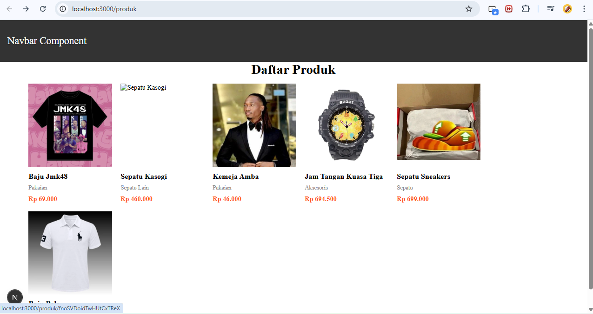

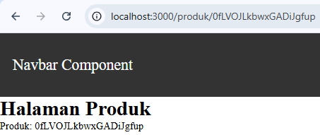

## Langkah 2 – Implementasi CSR (Client Rendering)

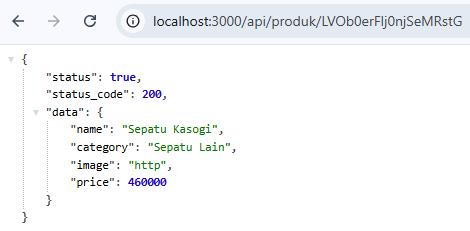

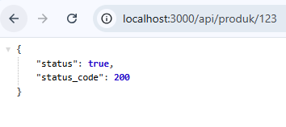

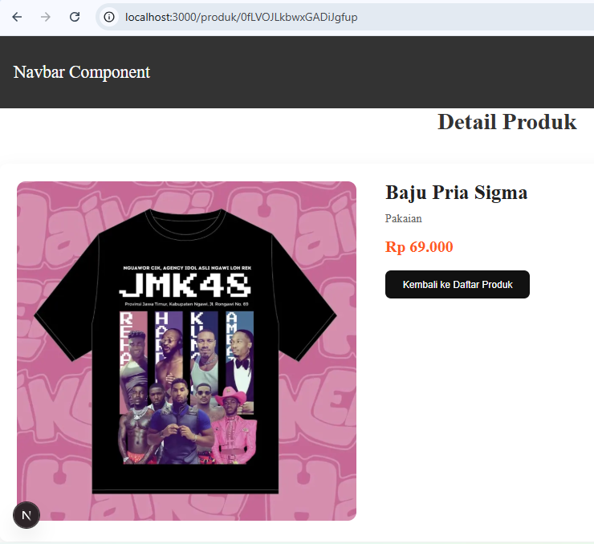

## Langkah 3 – Implementasi SSR

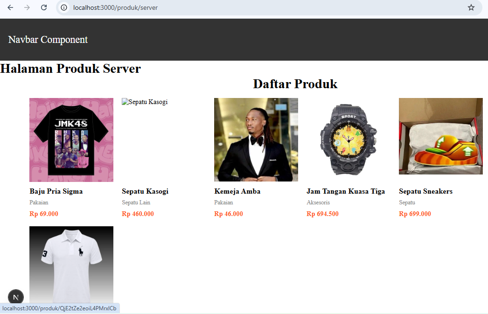

## Langkah 4 – Implementasi Static Site Generation (Dynamic SSG)

## Pengujian

### Uji 1 - CSR

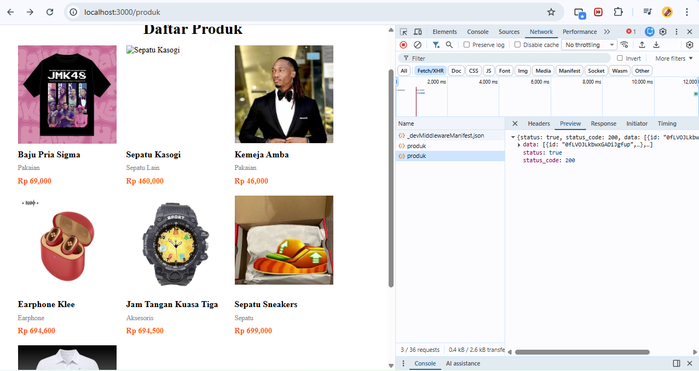

### Uji 2 - SSR

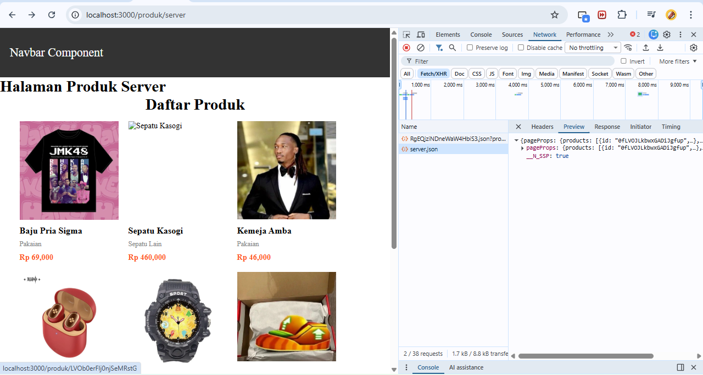

### Uji 3 - SSG

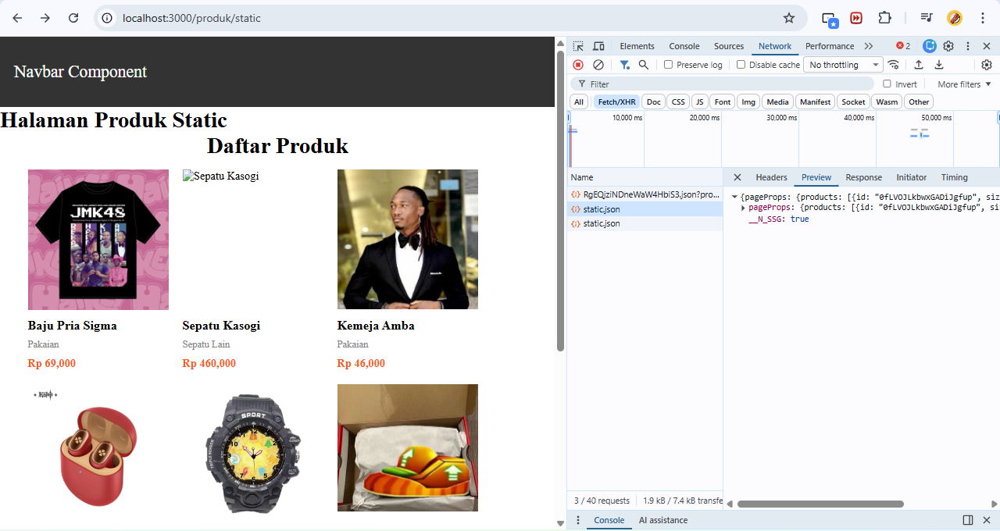

## Tugas Praktikum

### CSR
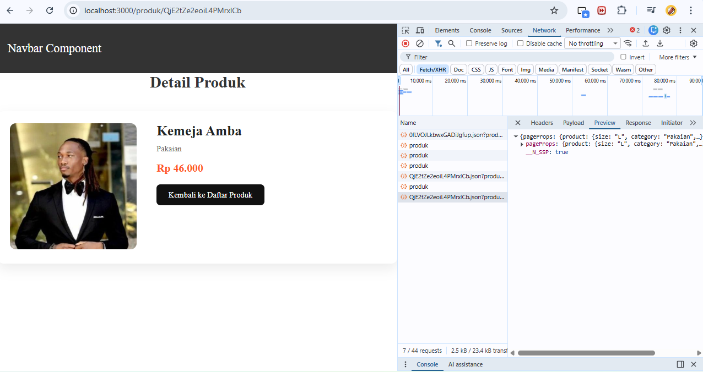

### SSR
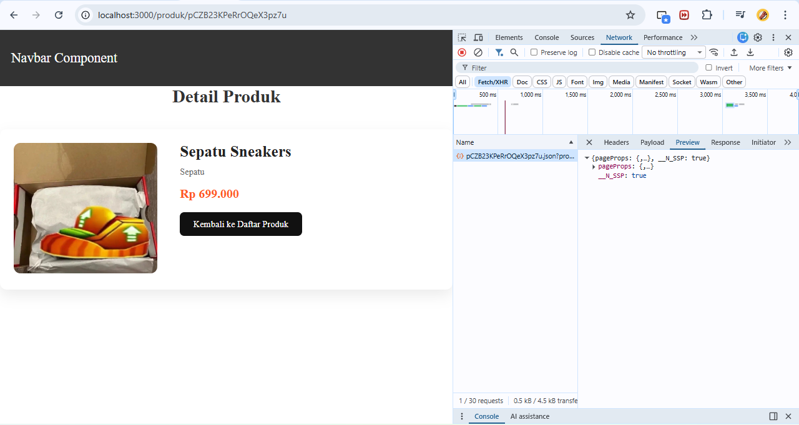

### SSG
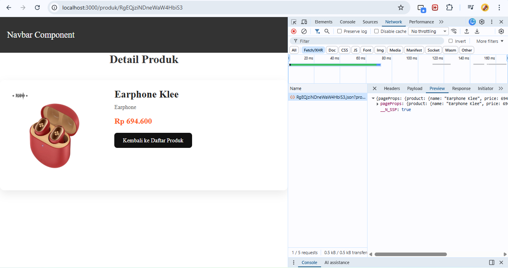

## Tabel Perbandingan
| Aspek | CSR (Client-Side Rendering) | SSR (Server-Side Rendering) | SSG (Static Site Generation) |
| :--- | :--- | :--- | :--- |
| **Loading** | Tampilan dasar cepat muncul, tapi data butuh jeda waktu (*loading*) untuk tampil karena di-fetch dari browser. | Tampilan awal mungkin sedikit lebih lama (menunggu server merender), tapi saat muncul data sudah utuh. | **Sangat Cepat**. Halaman langsung muncul secara utuh seketika karena HTML sudah disiapkan sebelumnya. |
| **Build Required** | Tidak wajib untuk data. Data diambil saat aplikasi sudah berjalan (Runtime). | Tidak wajib untuk data. Data diambil setiap kali ada *request* (Runtime). | **Wajib**. Data diambil dan halaman HTML dibuat secara permanen *pada saat* proses `npm run build` dijalankan. |
| **SEO** | **Kurang Bagus**. Bot Google sering kali hanya melihat kerangka halaman kosong saat melakukan *crawling*. | **Sangat Bagus**. Bot Google melihat struktur HTML yang sudah berisi data lengkap. | **Sangat Bagus**. Bot Google melihat struktur HTML statis yang sudah berisi data lengkap. |
| **Perubahan Data** | **Real-time**. Data selalu terbaru setiap kali user membuka halaman. | **Real-time**. Data selalu terbaru setiap kali user me-refresh halaman. | **Statis**. Data tidak akan berubah (menggunakan data lama) sampai kamu menjalankan *build* ulang. |

## Pertanyaan Analisis

1. Mengapa getStaticPaths wajib pada dynamic SSG?

Karena pada metode SSG, Next.js akan men- generate (mencetak) halaman HTML statis pada saat proses build (npm run build). Pada rute dinamis seperti [produk].tsx, Next.js tidak tahu ada berapa banyak produk dan apa saja ID-nya. Fungsi getStaticPaths wajib ada untuk memberikan "daftar ID produk" ke Next.js, sehingga Next.js tahu persis berapa banyak file HTML statis yang harus dibuatkan.

2. Mengapa CSR membutuhkan loading state?

Pada metode CSR (Client-Side Rendering), browser pengguna pada awalnya hanya menerima kerangka HTML kosong atau elemen UI dasar tanpa data. Pengambilan data (fetching) baru dilakukan oleh browser melalui JavaScript (seperti useSWR) setelah halaman dimuat. Waktu tunggu antara selesainya render kerangka web hingga data berhasil diambil dari database harus diisi dengan loading state (seperti efek skeleton atau spinner) agar pengguna tahu bahwa aplikasi sedang memproses data dan tidak hang atau error.

3. Mengapa SSG tidak menampilkan produk baru tanpa build ulang?

Karena SSG (Static Site Generation) hanya melakukan pengambilan data dari database dan mengunci wujud halamannya menjadi HTML statis satu kali saja, yaitu saat perintah npm run build dijalankan. Setelah itu, setiap kali ada pengguna yang membuka halaman tersebut, server hanya memberikan salinan file statis lama tanpa pernah menanyakan ulang ke database. Oleh karena itu, data baru tidak akan muncul sampai developer melakukan proses build ulang untuk mencetak file HTML versi terbaru.

4. Mana metode terbaik untuk halaman detail e-commerce?

Di antara ketiga metode tersebut, metode terbaik untuk halaman detail produk e-commerce adalah SSR (Server-Side Rendering).
e-commerce membutuhkan data yang 100% real-time (karena stok dan harga bisa berubah sewaktu-waktu) sekaligus membutuhkan SEO yang sangat baik agar produknya mudah ditemukan di mesin pencari Google. SSR memenuhi kedua kriteria ini dengan baik karena server merender wujud HTML secara instan beserta data terbaru setiap kali ada request masuk.

5. Apa risiko menggunakan SSG untuk produk yang sering berubah?
Risiko terbesarnya adalah menampilkan data yang sudah usang (stale data) kepada pelanggan. Misalnya, stok barang di database sebenarnya sudah habis atau harganya sudah naik, tetapi karena halaman SSG tidak di-build ulang, pengguna masih melihat status barang "Tersedia" dengan harga lama. Hal ini bisa menyebabkan pesanan gagal diproses saat pelanggan checkout dan merusak kepercayaan pelanggan terhadap sistem e-commerce tersebut.