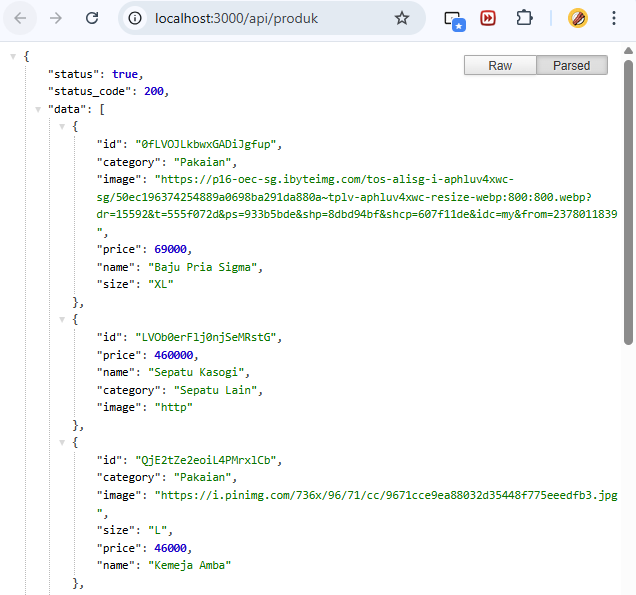
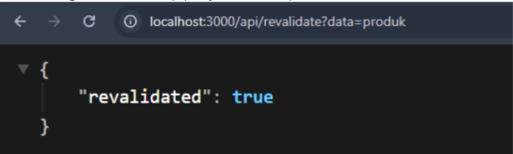
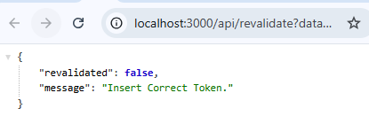
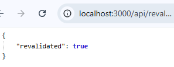

# Jobsheet 12 - Incremental Static Regeneration (ISR)

Luthfi Triaswangga

NIM : 2341720208

Kelas : TI 3D 

## Langkah 1 - Setup Halaman Static

```
import TampilanProduk from "@/views/product";
import { ProductType } from "@/types/Product.type";

const halamanProdukStatic = (props: { products: ProductType[] }) => {
  const { products } = props;
  return (
    <div>
      <h1>Halaman Produk Static</h1>
      <TampilanProduk products={products} />
    </div>
  );
};

export default halamanProdukStatic;

export async function getStaticProps() {
  // Simulasi pengambilan data produk dari API atau database
  const res = await fetch("http://127.0.0.1:3000/api/produk");
  const response: { data: ProductType[] } = await res.json();

  return {
    props: {
      products: response.data,
    },
  };
}

```

## Langkah 2 – Pengujian ISR

Route (pages)
┌ ○ /
├   /_app
├ ○ /404
├ ○ /about
├ ƒ /api/[[...produk]]
├ ƒ /api/hello
├ ○ /auth/login
├ ○ /auth/register
├ ○ /blog
├ ○ /blog/[slug]
├ ○ /category/[...slug]
├ ○ /produk
├ ƒ /produk/[produk]
├ ƒ /produk/server
├ ● /produk/static (1689 ms)
├ ○ /profile
├ ○ /profile/edit
├ ○ /setting/app
├ ○ /shop/[[...slug]]
├ ○ /user
└ ○ /user/password

○  (Static)   prerendered as static content
●  (SSG)      prerendered as static HTML (uses getStaticProps)
ƒ  (Dynamic)  server-rendered on demand

## Langkah 1 – Buat API Revalidate



## Langkah 2 - Tambahkan Parameter Data



## Langkah 3 – Tambahkan Token Security

```
REVALIDATE_TOKEN=12345678
```

## Pengujian Manual Revalidation

```
http://localhost:3000/api/revalidate?data=produk&token=12345678
```



```
http://localhost:3000/api/revalidate?data=produk&token=123456
```



## Tugas Praktikum 

Sudah saya terapkan pada Langkah langkah praktikum

