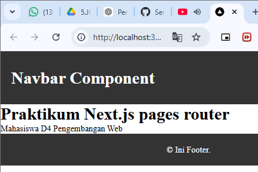
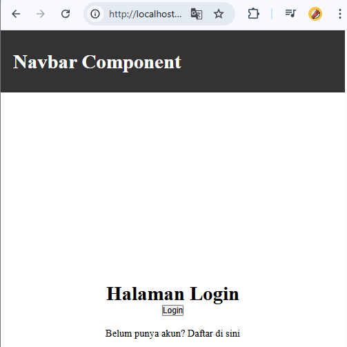
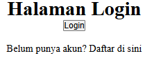
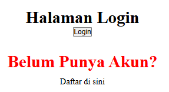
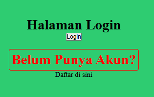
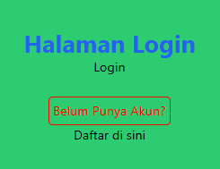
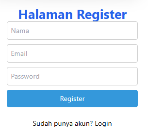
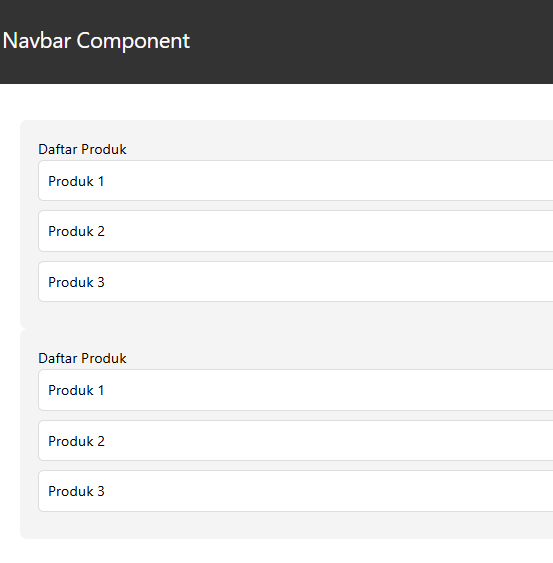

# Jobsheet 5 - Styling

Luthfi Triaswangga

NIM : 2341720208

Kelas : TI 3D 

# 1. Global CSS
a. File Global

`src/styles/global.css`

```
* {
  box-sizing: border-box;
  padding: 0;
  margin: 0;
}

html,
body {
  max-width: 100vw;
  overflow-x: hidden;
}

a {
  color: inherit;
  text-decoration: none;
}

.navbar {
  width: 100%;
  height: 60px;
  background-color: #333;
  color: #fff;
  display: flex;
  align-items: center;
  padding: 0 20px;
}

.footer {
  width: 100%;
  height: 60px;
  background-color: #333;
  color: #fff;
  display: flex;
  align-items: center;
  justify-content: center;
}
```

b. Import Global CSS

`src/styles/_app.tsx`

```
import '@/styles/globals.css'
import type { AppProps } from 'next/app'
import AppShell from '@/components/layouts/AppShell'
import Navbar from '@/components/layouts/navbar'

export default function App({ Component, pageProps }: AppProps) {
  return (
    <>
      <AppShell>
        <Component {...pageProps} />
      </AppShell>
    </>
  )
}
```

# 2. CSS Module (Local Scope)

a. Struktur Komponen Navbar

`src/components/layout/navbar/`

```
Membuat navbar.module.css
```

b. File CSS Module

Modifikasi navbar.module.css

```
.navbar {
    width: 100%;
    height: 100px;
    background-color: #333;
    display: flex;
    color: white;
    align-items: center;
    padding: 0 20px;
}
```

c. Pemanggilan di Komponen

Modifikasi kode pada index.tsx pada folder navbar

```
import styles from "./navbar.module.css";

const Navbar = () => {
  return (
    <div className={styles.navbar}>
        <h1>Navbar Component</h1>
    </div>
  )
}

export default Navbar
```


# 3. Styling untuk Pages (CSS Modules)

a. Contoh login page

`src/pages/auth/`

Modifikasi login.module.css

```
.login {
    display: flex;
    flex-direction: column;
    align-items: center;
    justify-content: center;
    height: 100vh;
}
```

Modifikasi login.tsx

```
import styles from "./login.module.css";
<div className={styles.login}>
```



# 4. Conditional Rendering Navbar (Tanpa Navbar di Login)

 Modifikasi index.tsx pada folder appshell

 ```
import { useRouter } from "next/router";
const disableNavbar = ["/auth/login", "/auth/register"];
const {pathname} = useRouter();
{!disableNavbar.includes(router.pathname) && <Navbar />}
```



# 5. Refactoring Struktur Project (Best Practice)

`pages/auth/login/index.tsx`

```
import TampilanLogin from "../views/auth/login";

const halamanLogin = () => {
  return <TampilanLogin />;
}

export default halamanLogin;
```

pages/views/auth/login/indes.tsx

```
import Link from "next/link";
import { useRouter } from "next/router";
import styles from "./login.module.css";

const TampilanLogin = () => {
  const { push } = useRouter();

  const handleLogin = () => {
    push("/produk"); // imperatif navigation
  };

  return (
    <div className={styles.login}>
      <h1>Halaman Login</h1>

      <button onClick={handleLogin}>Login</button>

      <br />

      <Link href="/auth/register">
        Belum punya akun? Daftar di sini
      </Link>
    </div>
  );
};

export default TampilanLogin;
```


# 6. Inline Stylinh (CSS in JS)

Modifikasi index.tsx pada `views/auth/login`

```
<h1 style={{ color: "red",borderRadius: "10px",padding: "10px",}}>Belum Punya Akun?</h1>
```



# 7. Kombinasi Global CSS + CSS Module

Modifikasi global.css

```
.big {
  font-size: 1.5rem;
}
```

Modifikasi index.tsx pada `components/layout/navbar`

```
<div className="big">Navbar Component</div>
```

# 8. SCSS (SASS)

a. Install SASS

```
PS D:\Kuliah\Belajar\Semester 6\Pemrograman Berbasis Framework\Minggu 4\my-app> npm i --save-dev sass

added 8 packages, and audited 350 packages in 8s

142 packages are looking for funding
  run `npm fund` for details

found 0 vulnerabilities
```

b. Global Variable

Modifikasi `colors.scss`

```
$schema:(
    color-primary: #3498db,
    color-secondary: #2ecc71,
    color-accent: #e74c3c,
    color-background: #ecf0f1,
    color-text: #2c3e50,
)
```

c. Gunakan di Module

Modifikasi login.module.scss pada `views/auth/login`

```
@import "@/styles/colors.scss";

.login {
    display: flex;
    flex-direction: column;
    align-items: center;
    justify-content: center;
    height: 100vh;
    background-color: map-get($map: $schema, $key:color-secondary);
}
```



# 9. Tailwind CSS

a. Install

```
PS D:\Kuliah\Belajar\Semester 6\Pemrograman Berbasis Framework\Minggu 4\my-app> npm install -D tailwindcss postcss autoprefixer

added 5 packages, changed 1 package, and audited 355 packages in 6s

145 packages are looking for funding
  run `npm fund` for details

found 0 vulnerabilities
```

Downgrade versi tailwindcss

```
npm install tailwindcss@3 postcss autoprefixer

added 35 packages, changed 1 package, and audited 390 packages in 17s

152 packages are looking for funding
  run `npm fund` for details

found 0 vulnerabilities
```

```
PS D:\Kuliah\Belajar\Semester 6\Pemrograman Berbasis Framework\Minggu 4\my-app> npx tailwindcss init -p

Created Tailwind CSS config file: tailwind.config.js
Created PostCSS config file: postcss.config.js  
```

b. Konfigurasi `tailwind.config.js`

```
"./src/**/*.{js,jsx,ts,tsx,mdx}",
"./pages/**/*.{js,jsx,ts,tsx,mdx}",
"./components/**/*.{js,jsx,ts,tsx,mdx}",
"./src/**/*.{js,jsx,ts,tsx,mdx}",
```

c. Import di `global.css`

```
@tailwind base;
@tailwind components;
@tailwind utilities;
```



# Tugas Praktikum

## Tugas 1



## Tugas 2



## Tugas 3


# Pertanyaan Refleksi

1. Kapan sebaiknya menggunakan CSS Module dibanding Global CSS?


2. Apa kelemahan inline styling?


3. Mengapa SCSS cocok untuk project skala besar?


4. Apa keunggulan Tailwind dibanding CSS tradisional?

