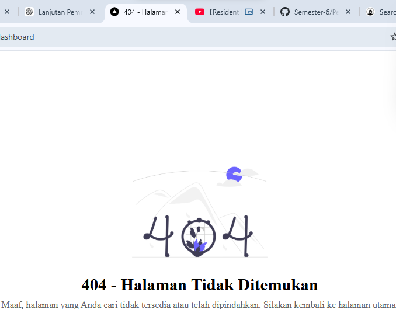
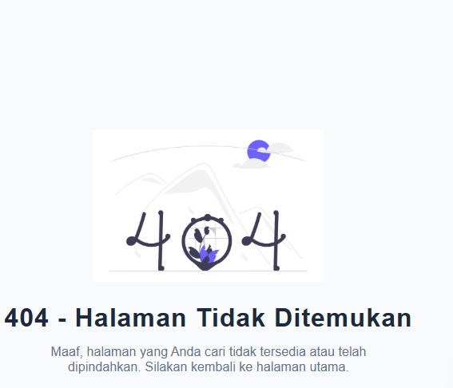
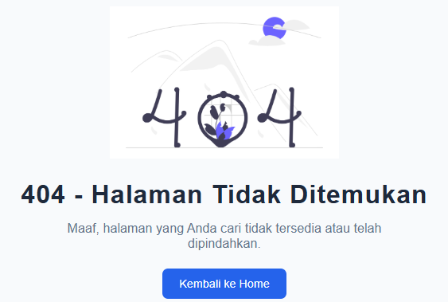

# Jobsheet 6 - Custom Document dan Custom Error

Luthfi Triaswangga

NIM : 2341720208

Kelas : TI 3D 

## 1. Menjalankan Project

```
npm uninstall tailwindcss postcss autoprefixer 

removed 40 packages, and audited 342 packages in 7s


138 packages are looking for funding
  run `npm fund` for details

found 0 vulnerabilities
npm notice
npm notice New minor version of npm available! 11.6.2 -> 11.11.0
npm notice Changelog: https://github.com/npm/cli/releases/tag/v11.11.0
npm notice To update run: npm install -g npm@11.11.0
npm notice
```

## 2. Membuat Custom Document

```
<Html lang="id">
```

## 3. Pengaturan Title per Halaman

```
<Head>
    <title>Praktikun Next.js Pages Router</title>
</Head>
```


## 4. Membuat Custom Error Page 404


## 5. Styling Halaman 404


## 6. Menampilkan Gambar dari Folder Public


## Tugas 1 - Judul Halaman



## Tugas 2 - Disable Navbar



## Tugas 3 - Link to Home




# Pertanyaan Refleksi

1. Apa fungsi utama _document.js? 

Fungsi utama _document.js adalah untuk mengatur struktur dasar HTML pada aplikasi Next.js secara global, seperti elemen <html>, <head>, dan <body>. File ini biasanya digunakan untuk menambahkan atribut global seperti lang, meta tag untuk SEO atau verifikasi, serta menyisipkan resource eksternal seperti CDN, font, atau script analytics yang berlaku untuk seluruh halaman aplikasi.


2. Mengapa <title> tidak disarankan di _document.js? 

Tag <title> tidak disarankan ditempatkan di _document.js karena judul halaman biasanya berbeda pada setiap halaman website. Jika diletakkan di _document.js, maka semua halaman akan memiliki judul yang sama. Oleh karena itu, Next.js menyediakan komponen Head pada masing-masing halaman agar judul dapat diatur secara dinamis sesuai dengan konten halaman tersebut.


3. Apa perbedaan halaman biasa dan halaman 404.js? 

Perbedaan halaman biasa dan halaman 404.js adalah bahwa halaman biasa dibuat untuk menampilkan konten yang dapat diakses melalui route tertentu, seperti halaman home atau dashboard, sedangkan halaman 404.js merupakan halaman khusus yang otomatis ditampilkan oleh Next.js ketika pengguna mengakses URL atau route yang tidak tersedia di dalam aplikasi.


4. Mengapa folder public tidak perlu di-import?

Folder public tidak perlu di-import karena Next.js secara otomatis menjadikannya sebagai direktori penyimpanan aset statis yang dapat diakses langsung melalui URL aplikasi. File seperti gambar, ikon, atau dokumen yang disimpan di dalam folder public dapat dipanggil langsung menggunakan path relatif, misalnya /image.png, tanpa perlu proses import seperti pada file JavaScript atau komponen React.