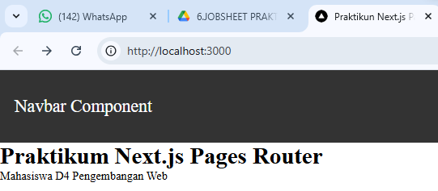
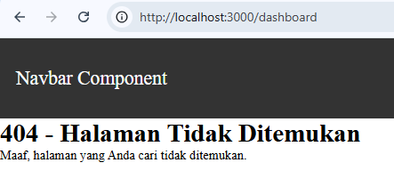
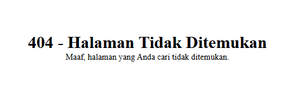
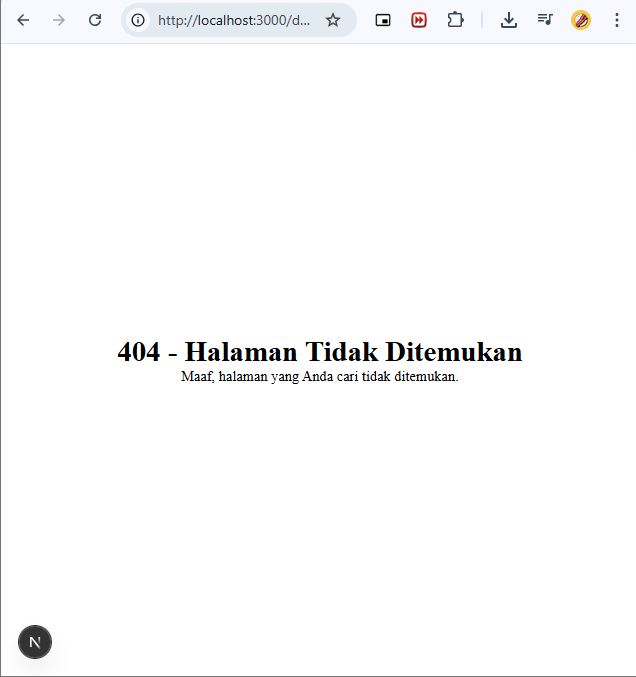

# Jobsheet 6 - Custom Document dan Custom Error

Luthfi Triaswangga

NIM : 2341720208

Kelas : TI 3D 

## 1. Menjalankan Project

```
npm uninstall tailwindcss postcss autoprefixer 

removed 40 packages, and audited 342 packages in 7s


138 packages are looking for funding
  run `npm fund` for details

found 0 vulnerabilities
npm notice
npm notice New minor version of npm available! 11.6.2 -> 11.11.0
npm notice Changelog: https://github.com/npm/cli/releases/tag/v11.11.0
npm notice To update run: npm install -g npm@11.11.0
npm notice
```

## 2. Membuat Custom Document

```
<Html lang="id">
```

## 3. Pengaturan Title per Halaman

```
<Head>
    <title>Praktikun Next.js Pages Router</title>
</Head>
```


## 4. Membuat Custom Error Page 404



## 5. Styling Halaman 404





