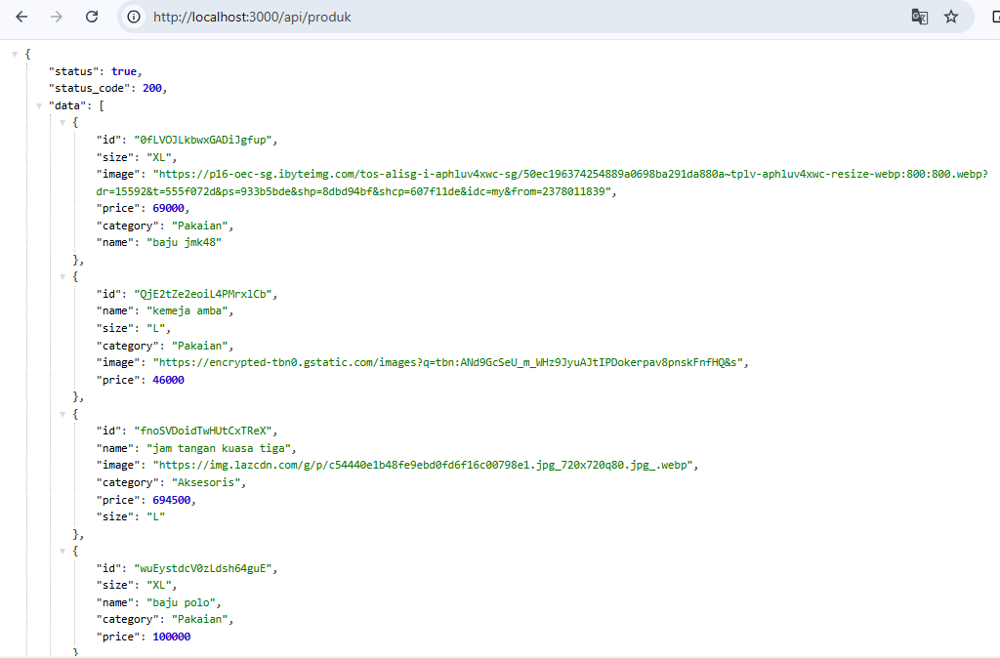
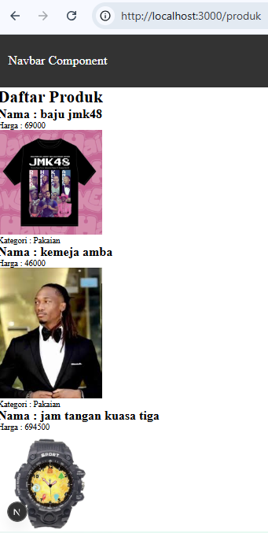
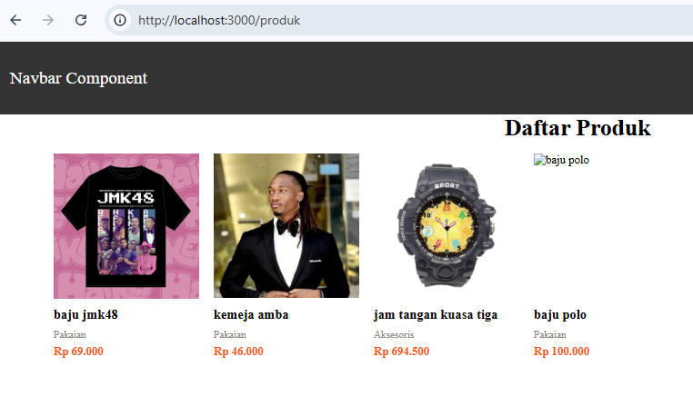
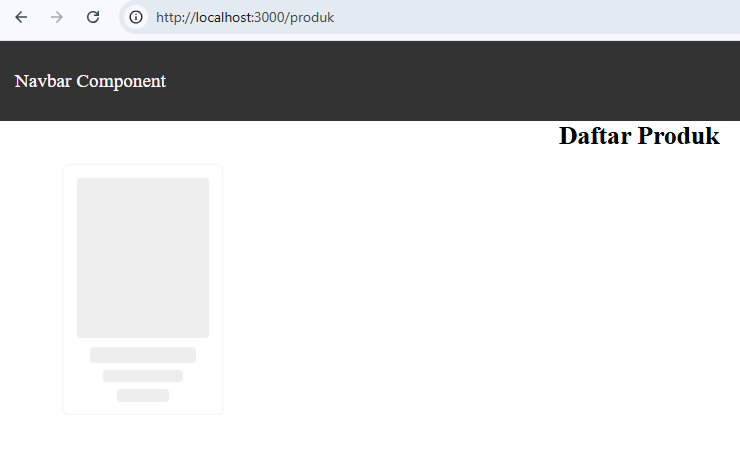

# Jobsheet 8 - Client Side Rendering & Data Fetching

Luthfi Triaswangga

NIM : 2341720208

Kelas : TI 3D 

## Langkah 1 - Setup Data Produk



## Langkah 2 - Implementasi CSR dengan useEffect





## Langkah 3 - Implementasi Skeleton Loading



## Langkah 5 - Implementasi SWR

```
npm install swr

added 3 packages, and audited 432 packages in 7s

144 packages are looking for funding
  run `npm fund` for details

found 0 vulnerabilities
```

## Tugas 1 - Defisinisikan Rendering

1. Client Side Rendering (CSR)

Client Side Rendering adalah metode rendering halaman web yang dilakukan di sisi browser (client). Pada teknik ini, server hanya mengirimkan file HTML dasar dan JavaScript, kemudian browser akan menjalankan JavaScript tersebut untuk mengambil data dari API dan merender tampilan halaman. Akibatnya, halaman awal biasanya memerlukan waktu sedikit lebih lama sebelum data muncul karena proses pengambilan data dilakukan setelah halaman dimuat. CSR sangat cocok digunakan untuk aplikasi web yang interaktif seperti dashboard, aplikasi SPA (Single Page Application), atau halaman yang sering melakukan update data tanpa harus me-refresh halaman.

2. Server Side Rendering (SSR)

Server Side Rendering adalah metode rendering di mana proses pembuatan halaman HTML dilakukan di sisi server sebelum dikirim ke browser pengguna. Ketika pengguna membuka suatu halaman, server akan mengambil data yang diperlukan terlebih dahulu, kemudian merender halaman lengkap dengan datanya dan mengirimkan HTML yang sudah siap ditampilkan ke browser. Keuntungan utama SSR adalah halaman dapat ditampilkan lebih cepat pada saat pertama kali dibuka dan lebih baik untuk SEO karena mesin pencari dapat langsung membaca konten halaman yang sudah lengkap.

3. Static Site Generation (SSG)

Static Site Generation adalah metode rendering di mana halaman web dibuat secara statis pada saat proses build aplikasi, bukan saat pengguna mengakses halaman. Data yang diperlukan sudah diambil sebelumnya dan hasilnya disimpan sebagai file HTML statis yang siap dikirim ke pengguna. Karena halaman sudah dibuat sebelumnya, SSG memiliki performa yang sangat cepat dan efisien ketika diakses. Metode ini sangat cocok digunakan untuk website yang kontennya jarang berubah, seperti blog, dokumentasi, atau halaman profil perusahaan.

## Tugas 2 - Animasi Skeleton Loading


