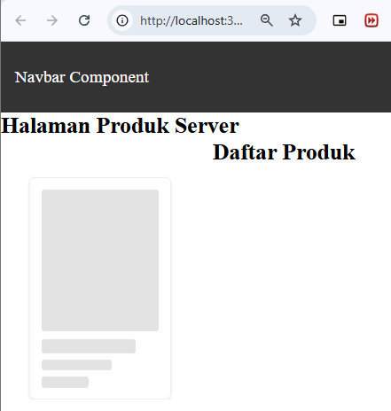
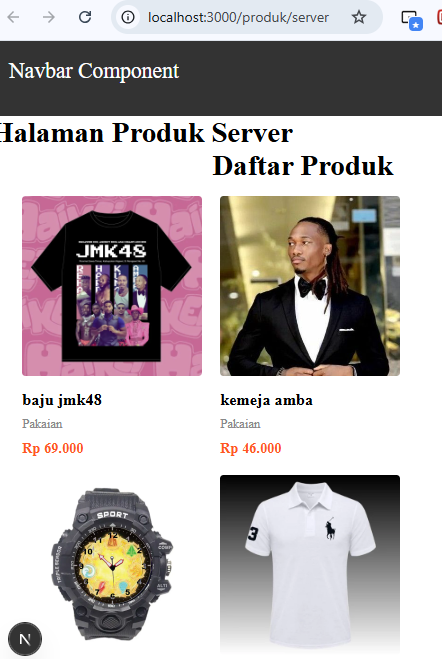
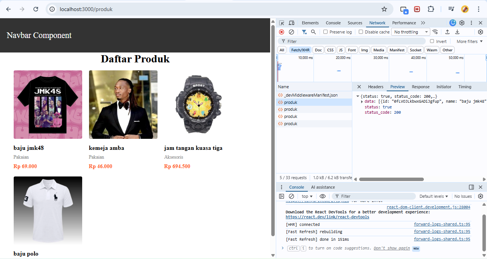
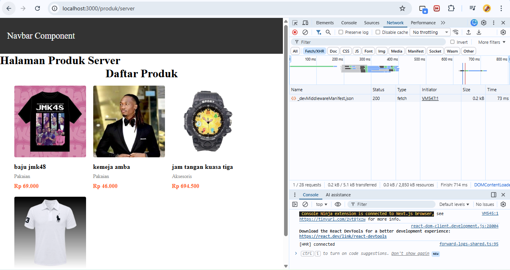

# Jobsheet 8 - Server Side Rendering

Luthfi Triaswangga

NIM : 2341720208

Kelas : TI 3D 

## Langkah 1 - Setup Halaman SSR

## Langkah 2 – Implementasi getServerSideProps pada server.tsx

## Langkah 3 – Refactor Type ( produk type )

## Langkah 4 – Uji Perbedaan SSR vs CSR

